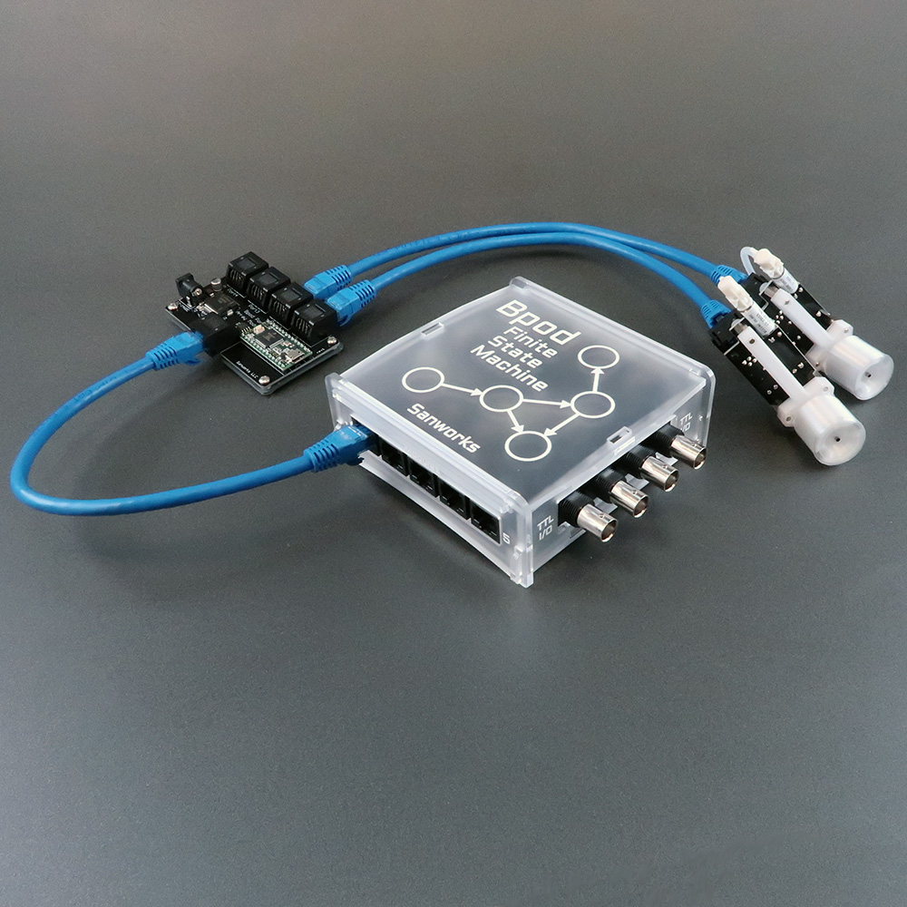
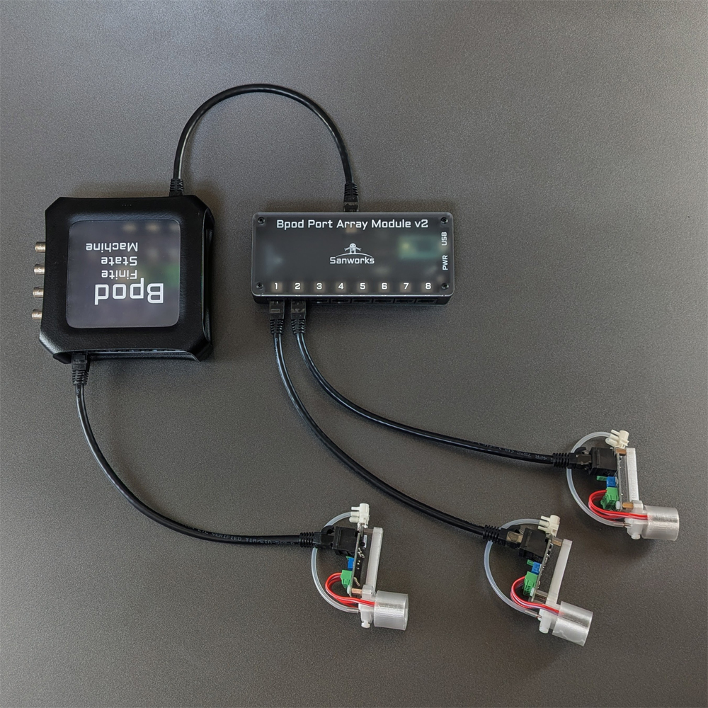

# Port Array Module
  
Version 1, released November 2017

  
Version 2, released September 2025

The Port Array Module interfaces additional behavior ports to a Bpod State Machine.

Up to 5 port array modules may be used with a single state machine, for experiments requiring large numbers of behavior ports.

The Port Array Module is compatible with state machine r0.7+

Firmware for the Port Array Module is available [here](https://github.com/sanworks/Bpod_PortArray_Firmware).

Hardware Specs:

- Arduino-compatible ARM Cortex processors.
    - **V1**: Cortex M4, 96MHz ([Teensy 3.2](https://www.pjrc.com/store/teensy32.html), PJRC).
    - **V2**: Cortex M7, 600MHz ([Teensy 4.0](https://www.pjrc.com/store/teensy40.html), PJRC)
- Isolated valve driver IC.
    - **V1** Infineon [ISO1H811](https://www.infineon.com/assets/row/public/documents/24/49/infineon-iso1h811g-ds-en.pdf?folderId=db3a30431b3e89eb011b8dbc543010a5&fileId=db3a304320896aa201208af1f76c0075).
    - **V2**: Infineon [ISO1H816](https://www.infineon.com/assets/row/public/documents/24/49/infineon-iso1h816g-ds-en.pdf?folderId=db3a30431b3e89eb011b8dbc543010a5&fileId=db3a304320d39d590120f700bb736a89).
- Valve power source: External wall adapter, 12-24VDC, positive-center barrel jack
- Processor power source: USB

## Bill of Materials
V1:
<iframe width=1000 height=500 jsname="L5Fo6c" jscontroller="usmiIb" jsaction="rcuQ6b:WYd;" class="YMEQtf L6cTce-purZT L6cTce-pSzOP KfXz0b" sandbox="allow-scripts allow-popups allow-forms allow-same-origin allow-popups-to-escape-sandbox allow-downloads allow-modals" frameborder="0" aria-label="Spreadsheet, Port Array Module BOM" allowfullscreen="" src="https://docs.google.com/spreadsheets/d/1koG_JYqBlHM2BV03bhV4nlo765IEthSyIkxVXH9f-bA/htmlembed?authuser=0"></iframe>

V2:
<iframe width=1000 height=500 jsname="L5Fo6c" jscontroller="usmiIb" jsaction="rcuQ6b:WYd;" class="YMEQtf L6cTce-purZT L6cTce-pSzOP KfXz0b" sandbox="allow-scripts allow-popups allow-forms allow-same-origin allow-popups-to-escape-sandbox allow-downloads allow-modals" frameborder="0" aria-label="Spreadsheet, Port Array Module BOM" allowfullscreen="" src="https://docs.google.com/spreadsheets/d/1PW10vzMTci7HT5Idu3ZZq2-9_HVAZze_4vlSxoIrqyc/htmlembed?authuser=0"></iframe>
