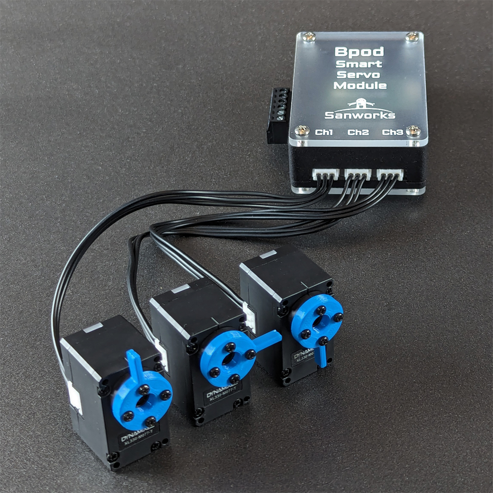

# Smart Servo Module
  
The Bpod Smart Servo Module controls up to 9 Dynamixel [X-series](https://www.robotis.us/x-series/) servo motors.

Smart servo motors offer capabilites beyond popular "hobby" servos. They are controlled via serial interface, and follow parametric movement trajectories. Movement feedback is provided by a 4096-position magnetic encoder built into each motor, for precise position control.

Control modes are available for continuous rotation, current-limited movement and stepping relative to the current position. Additional capabilities include position readback, motor auto-detection and torque control.

The module can store a library of motor programs each consisting of timed movements addressing any connected motor.

A screw terminal interface exposes DIO channels for triggering from pushbuttons and external instruments.

Key specs are:

- Arduino-compatible 600MHz ARM Cortex M7 processor ([Teensy 4.0](https://www.pjrc.com/store/teensy40.html))
- Compatibility: Dynamixel [X-series](https://www.robotis.us/x-series/) servos with TTL interface (part name ending in T)
- Motor Serial Channels: 3
- Motors Supported: 9 (3 daisy-chained per channel)
- Motor voltage: 5V-12V via external wall adapter. All motors connected to a single module must use the same voltage.
- USB Motor Power: Enabled via internal jumper. Use at your own risk with X-series 5V motors only.
- Control modes:
    - Position: set a goal position in range (0, 360) deg
    - Extended position: set a goal position in range (-91800, 91800) deg
    - Current-limited position: set a goal position and a maximum motor current (mA)
    - Velocity: set continuous rotation at a target velocity (rev/s)
    - Step: Move degrees relative to the current position
- Motor programs:
    - Total programs: 100
    - Max steps per program: 255
    - Triggering: State Machine, TTL/pushbutton or USB (MATLAB/Python)
- Movement parameters:
    - Goal position (degrees)
    - Maximum velocity (rev/s)
    - Maximum acceleration (rev/s^2)
    - Maximum motor current (Control mode 3 only)
- Readback via USB:
    - Position
    - Motor temperature
- Triggering:
    - Parametric single-movement command via USB or State Machine
    - Motor program (previously loaded) triggered via USB, State Machine or DIO
- DIO Interface: Three DIO channels are exposed via a screw terminal. Configured as inputs they can:
    - Start motor programs
    - Stop motor programs
    - Stop all motors, setting torque to 0

    Each channel is pulled weakly high, so a pushbutton can be installed between the channel and GND.

The Smart Servo module is controlled from MATLAB with the [SmartServoModule class](../module-documentation/smart-servo-module.md).

Its interfaces to the Bpod State Machine and USB are documented [here](../serial-interfaces/smartservo-module-serial-interface.md).

## Bill of Materials
<iframe height=700 width=1000 jsname="L5Fo6c" jscontroller="usmiIb" jsaction="rcuQ6b:WYd;" class="YMEQtf L6cTce-purZT L6cTce-pSzOP KfXz0b" sandbox="allow-scripts allow-popups allow-forms allow-same-origin allow-popups-to-escape-sandbox allow-downloads allow-modals" frameborder="0" aria-label="Spreadsheet, HiFi Module BOM" allowfullscreen="" src="https://docs.google.com/spreadsheets/d/1oh4Q-Q--QrnJo__KXl1W4AzTE-k0obUBH9t0_Pym-us/htmlembed?authuser=0"></iframe>
