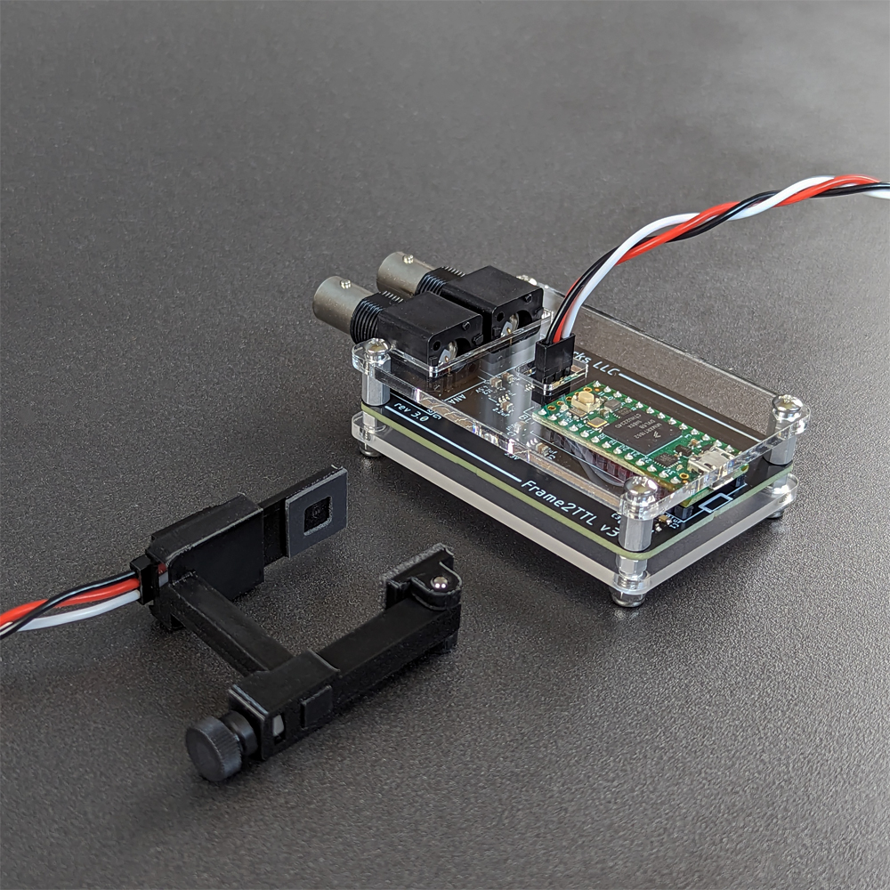

# Frame2TTL

PC monitors are often used to deliver visual stimuli. Bpod can measure video frame onset/offset times using Frame2TTL, an open source tool developed and maintained by Sanworks LLC.

Here are some useful links to get started:

Wiki:

[https://sites.google.com/site/frame2ttl](https://sites.google.com/site/frame2ttl)

Repository:

[https://github.com/sanworks/Frame2TTL](https://github.com/sanworks/Frame2TTL)
