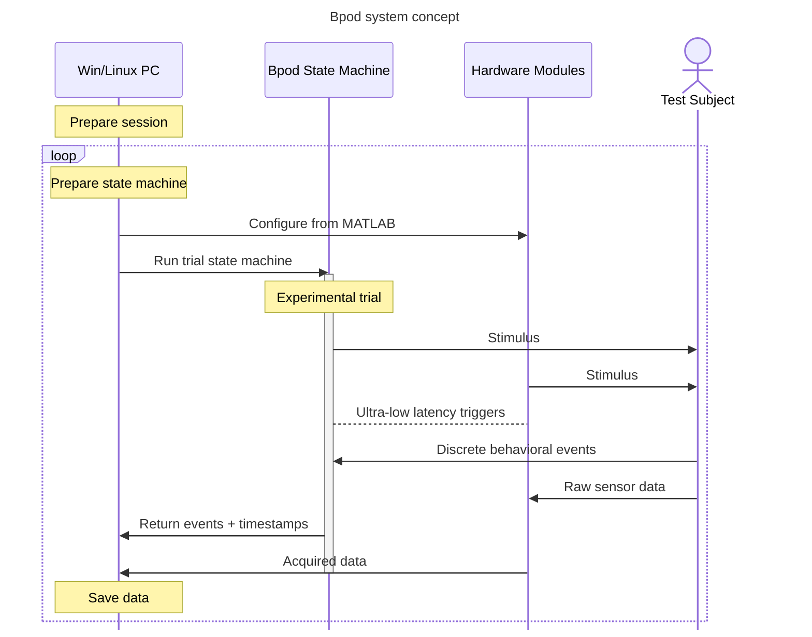

<h1 style="text-align: center;">Welcome to the Bpod Wiki</h1>

    

    <em>Bpod: An open source platform for rodent behavior measurement & real-time stimulus control.</em>

---

**MATLAB control software**: [https://github.com/sanworks/Bpod_Gen2](https://github.com/sanworks/Bpod_Gen2)

**Firmware source code**: [Firmware Repository Directory](install-and-update/firmware-repo-list.md)

**Computer Aided Design (CAD) files**: [https://github.com/sanworks/Bpod-CAD](https://github.com/sanworks/Bpod-CAD)

**Support forums**: [https://sanworks.io/forums/](https://sanworks.io/forums/)

---

!!! important note

    :construction: The Bpod Wiki has been migrated here from [Google Sites](https://sites.google.com/site/bpoddocumentation/home?authuser=0) - a major community contribution by [George Stuyt](https://github.com/ogeesan)! The legacy wiki will remain available to support old links, but its content will be frozen as of October 1, 2023.

Bpod highlights:

- Bpod is an open source platform for rodent behavior measurement and stimulus control
- Experimental trials are set up by the user in MATLAB, and executed by a hierarchy of real-time processors
- Arduino based architecture simplifies user extendibility
- A growing array of Bpod hardware modules encapsulate common behavioral instrumentation techniques
- Since 2013, Bpod has powered behavioral data collection in over 150 [publications](https://sanworks.io/science/science.php)

## About Bpod
Bpod is an open source system for real-time behavior measurement in tasks consisting of multiple experimental trials. Experiment software is written in MATLAB, and device firmware is written in [Arduino](https://www.arduino.cc/). Hardware can be assembled with DIY desktop manufacturing methods:  soldering, 3-D printing, laser cutting and hand-tapping. The system architecture is low cost, and supremely hackable - precisely what is necessary to explore a space of behavioral metrics, or to train test subjects with high throughput. This wiki contains documentation to support hardware assembly and behavioral protocol development.

Bpod was initially developed in [Kepecs Lab](https://sites.wustl.edu/kepecslab/) during its term at Cold Spring Harbor Laboratory, as a project alongside the lead developer's thesis research. It is maintained by [Sanworks LLC](https://sanworks.io/), a company dedicated to developing Bpod and other open neuroscience tools.

Bpod builds on the central design concept of [B-control](http://brodywiki.princeton.edu/bcontrol/index.php/Main_Page), a system provided by [Brody Lab](http://brodylab.org/) at Princeton University for rodent behavior measurement. Experimental trials are constructed in MATLAB as [finite state machines](https://en.wikipedia.org/wiki/Finite-state_machine), and executed on a separate real-time Linux computer. Bpod builds on this central design concept by combining its parallel processing model with the accessibility of embedded computing in the Arduino language. Bpod provides a rich suite of software tools in high level interpreted computing environments for protocol development and online analysis, while real-time processing is delegated to an Arduino microcontroller network governed by finite state machine logic.

<!-- todo: make this into an actual schematic -->

We love hearing about the awesome [science](https://sanworks.io/science/science.php) that is generated with Bpod!

Please post on the [Forums](https://sanworks.io/forums/) with your questions and feedback, or [email us](https://sanworks.io/about/contact.php) directly.
