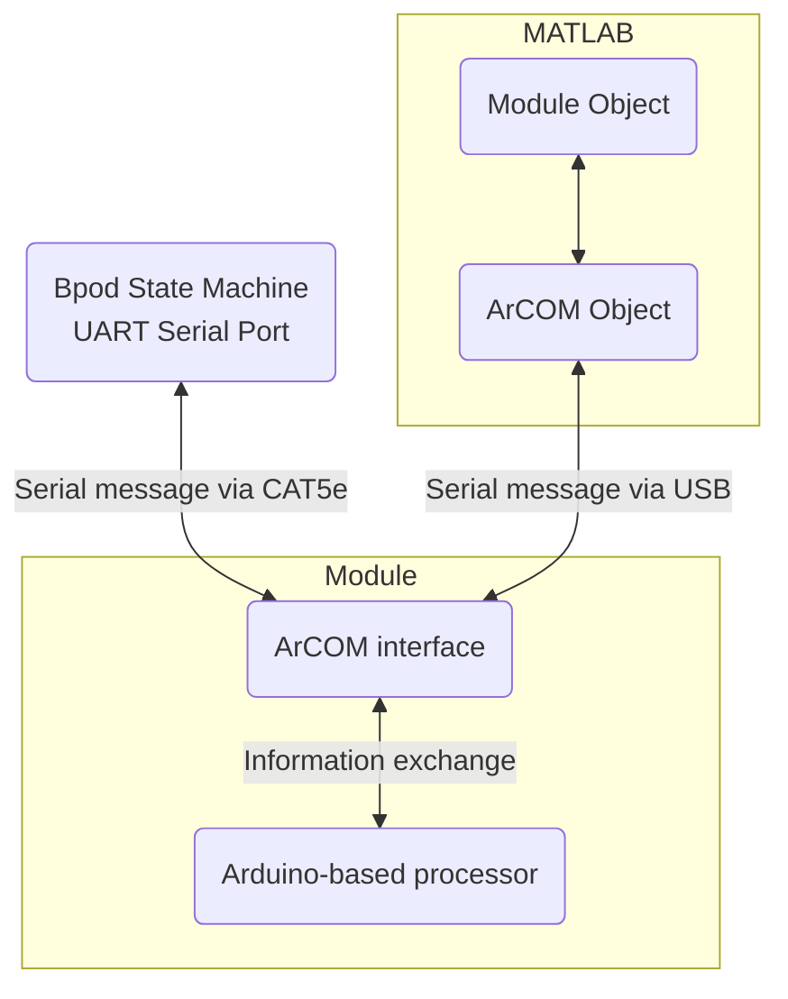

# Modules
Beyond the behavior port and logic channels onboard the Bpod State Machine, it's hard to anticipate what kinds of devices Bpod will need to control in future experiments. As a general expansion framework, several [UART](https://en.wikipedia.org/wiki/Universal_asynchronous_receiver-transmitter) serial ports of the state machine's microcontroller are exposed to support external Arduino or Raspberry Pi powered modules. In addition to the low latency UART interface to the state machine, most modules also have a high speed USB connection to the PC for setup and configuration.

Sanworks provides several Bpod modules that encapsulate common measurement and control functions. MATLAB control classes for those modules are given here.

## Module documentation
Each module is documented in three locations on the Wiki:

1. Hardware: located in Hardware > Modules, hardware specifications and the bill of materials required for construction.
2. UART Serial interface: located in 'Serial Interfaces' above, USB/serial port communication specifications
3. USB interface: located in MATLAB Software > Bpod Module APIs, plugins/class/API for programmatic module interaction via USB

In most cases, configuration of a module at the start of a session involves the use of its MATLAB API, while time-critical actions performed during a trial are triggered using low latency serial messages from the state machine.

## General explanation of module architecture

ArCOM is a library for Arduino developed by Sanworks to simplify data transactions between Arduino, MATLAB and Python. Rather than working directly in binary, ArCOM makes it easy to send and receive arrays of different data types from a module. The rationale for its development can be found [here](https://sanworks.io/news/viewArticle?articleID=ArCOM1).

### UART communication description

- The [UART serial ports](https://www.google.com/url?q=https%3A%2F%2Flearn.sparkfun.com%2Ftutorials%2Fserial-communication%2Fuarts&sa=D&sntz=1&usg=AOvVaw2e5bid8ez_clYR9sdmyEtv) are indicated on the enclosure as RJ45 ethernet jacks labeled "Modules" 1-N.
- The ports are configured to communicate with other microcontrollers at 1.3125Mb/s
- The state machine sends UART serial transmissions to modules using an RS485 IC at each end of the ethernet cable. This employs differential signaling over the Ethernet cable's twisted wire pairs, to make the digital messages more robust against noise.

## Building your own module/integrating existing Arduino system
The [Bpod Arduino Shield](../assembly/arduino-shield-gen2-assembly.md) is a simple circuit board used to interface the serial ports on the state machine and the UART pins on Arduino boards (Zero, Due, Adafruit Metro M4).

It will help to become familiar with the [Arduino language](https://www.arduino.cc/reference/en/), an excellent intro for which is located [here](https://www.google.com/url?q=https%3A%2F%2Flearn.sparkfun.com%2Ftutorials%2Fwhat-is-an-arduino&sa=D&sntz=1&usg=AOvVaw1od5YgunQFQgRDuuzRaBOE). Example firmware that can be used as a starting point is provided [here](https://github.com/sanworks/Bpod_Gen2/tree/master/Examples/Firmware/Bpod%20Shield).
