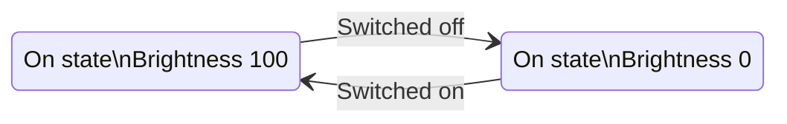

# State machine logic

## Introduction to the Bpod state machine

The Bpod system's behavior on each experimental trial is programmed as a [virtual finite state machine](http://www.google.com/url?q=http%3A%2F%2Fen.wikipedia.org%2Fwiki%2FVirtual_finite-state_machine&sa=D&sntz=1&usg=AOvVaw1DcMhaObbuC0WOA7hhGMCg). This ensures precise timing of events - for any state machine you program, state transitions will be completed in less than 100 microseconds - so inefficient coding won't reduce the precision of events in your data.

- Each state sets Bpod's outputs (Valves, LEDs, TTL I/O, etc).
- Events detected by Bpod can be set to trigger transitions between specific states.

Here is a simple finite state machine, describing a binary switch that controls a bulb with variable brightness:



- Each state contains a name ("On state" or "Off state"), a hardware description ("Brightness: X"), and events that trigger state transitions ("Switched on/off")

Here is the same diagram presented as a Bpod state machine description:

```matlab
sma = NewStateMatrix();   % Initializes a new, empty state machine
                          % description struct called "sma".

% Now add a new state called "OnState" to the description.
% When the state's timer elapses, the resulting event
% triggers a transition to "OffState".
sma = AddState(sma, 'Name', 'OnState', ...  
    'Timer', 1,...          % Sets the internal timer of "On state" to 1 second.
    'StateChangeConditions', {'Tup', 'OffState'},...  
    'OutputActions', {'PWM1', 255}); % Outputs for "On state". PWM1 sets Port 1's
                             % PWM-dimmed LED to max brightness (range = 0-255).

% Next add a new state called "OffState" to the description.
sma = AddState(sma, 'Name', 'OffState', ...
    'Timer', 1,...
    'StateChangeConditions', {'Tup', 'OnState'},...
    'OutputActions', {'PWM1', 0});
```

<!-- ## Modules

## Protocol design
Bpod is built for trial-based behavioral studies. -->
